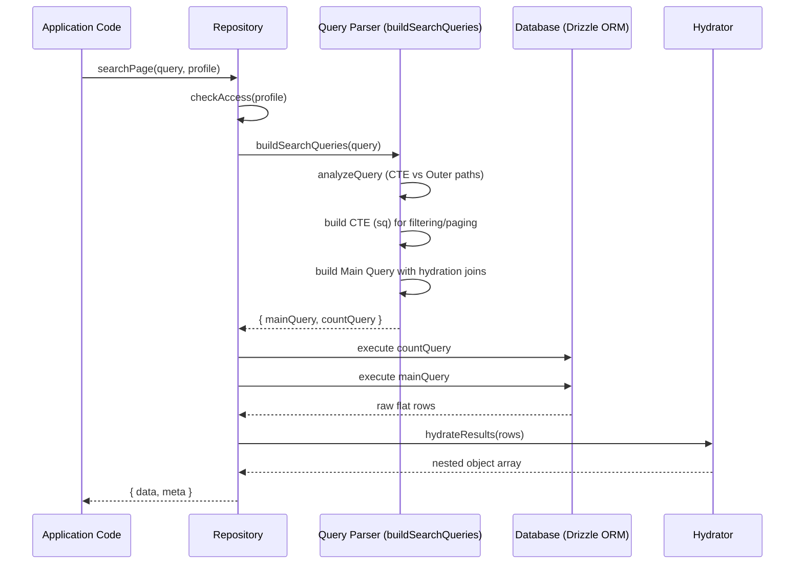
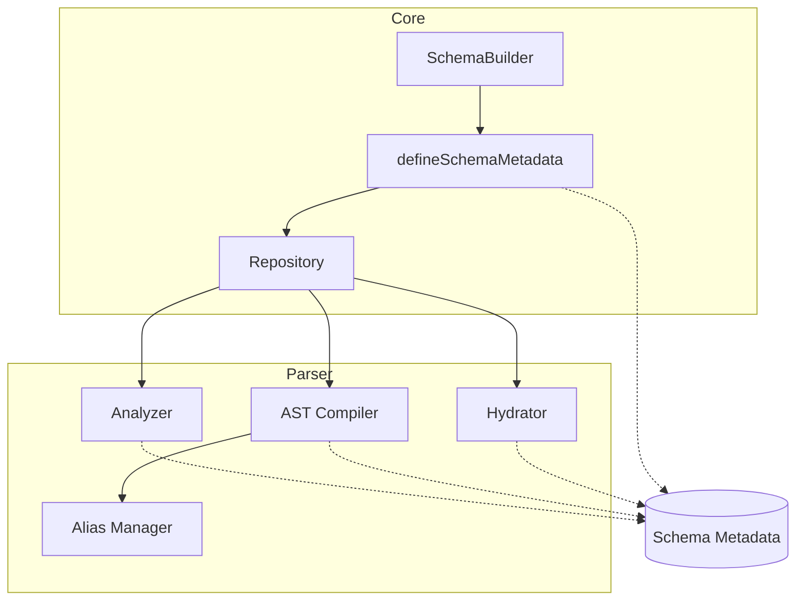

# Drizzle Castor

Drizzle Castor is a type-safe, and dynamic CRUD library for Drizzle ORM. It is designed to simplify database operations by providing a robust repository layer that handles complex queries, relations, access control, and hydration automatically.

## Overview

Working with ORMs often requires repetitive boilerplate for basic CRUD operations. Drizzle Castor abstracts this complexity into a generic repository pattern. It features a query parser that allows for deep relational joins, sophisticated filtering, and automatic result hydration—all while maintaining strict TypeScript safety.

## Key Features

- **Dynamic Repository Factory**: Automatically generate repositories for your Drizzle tables with a single configuration.
- **Query Parser**: A JSON-based query language supporting deep joins (via string paths), complex filtering logic, and nested projections.
- **Automatic Hydration**: Flat database results are automatically transformed into deeply nested object structures based on your relationship definitions.
- **Access Control (Profiles)**: Define granular access profiles to restrict actions (create, read, update, etc.) on a per-table basis.
- **Lifecycle Hooks**: Extend functionality with `beforeSearch` and `afterSearch` hooks for custom business logic or auditing.
- **Relation Management**: Supports One-to-One, One-to-Many, Many-to-One, and Many-to-Many relationships.
- **JSON Column Support**: Built-in support for querying and projecting nested properties within JSON columns.

## Installation

```bash
npm install @fajarnugraha37/drizzle-castor
```

Note: This package requires `drizzle-orm` and `typescript` as dependencies.

## Basic Usage

### 1. Define Your Schema and Metadata

First, define your Drizzle schema and the relationships between them using the `defineSchemaMetadata` utility.

```typescript
import { db } from "./db";
import { users, posts, comments } from "./schema";
import { defineSchemaMetadata } from "@fajarnugraha37/drizzle-castor";

const schema = defineSchemaMetadata(db, [users, posts, comments])({
  users: {
    oneToMany: [
      {
        relationName: "posts",
        relatedTable: "posts",
        foreignKey: "posts.userId",
        localKey: "users.id",
      },
    ],
    profiles: {
      default: ["read", "create", "update"],
      admin: ["read", "create", "update", "hardDelete"],
    },
  },
  posts: {
    manyToOne: [
      {
        relationName: "author",
        relatedTable: "users",
        localKey: "posts.userId",
        foreignKey: "users.id",
      },
    ],
    oneToMany: [
      {
        relationName: "comments",
        relatedTable: "comments",
        foreignKey: "comments.postId",
        localKey: "posts.id",
      },
    ],
    profiles: {
      default: ["read"],
    },
  },
  comments: {
    manyToOne: [
      {
        relationName: "post",
        relatedTable: "posts",
        localKey: "comments.postId",
        foreignKey: "posts.id",
      },
    ],
  },
});
```

### 2. Create a Repository

Use the `repoFactory` to create a repository for a specific table.

```typescript
const userRepo = schema.repoFactory("users", {
  default: {
    allowedProjections: ["*", "posts.*"],
  },
});
```

### 3. Execute Queries

The repository provides methods for standard CRUD operations and searching.

```typescript
// Search with deep joins and filters
const result = await userRepo.searchMany({
  projection: [
    "id",
    "name",
    "posts.title",
    "posts.comments.content"
  ],
  filter: {
    "posts.title": { $ilike: "%drizzle%" },
    "posts.comments.createdAt": { $gt: "2023-01-01" }
  },
  order: {
    "name": "asc"
  }
});
```

## Configuration and Initialization

### Configuration Modes
When calling `defineSchemaMetadata`, you can specify a mode: `strict` (default) or `lenient`.

- **Strict Mode**: Every table must have a profile defined. If a table is queried without a profile or if no profiles are defined for that table, an "Access Denied" error is thrown. This is the recommended mode for production.
- **Lenient Mode**: If a table has no profiles defined, it allows all actions by default. A warning is logged to the console on initialization.

```typescript
// Strict mode (recommended)
const schema = defineSchemaMetadata(db, tables, "strict")({ ... });
```

### Defining Relationships
Relationships are the backbone of the dynamic query parser and the type system.

#### One-to-Many (1:N)
Used when a record in Table A has multiple records in Table B.
```typescript
users: {
  oneToMany: [{
    relationName: "posts",
    relatedTable: "posts",
    foreignKey: "posts.userId",
    localKey: "users.id",
  }]
}
```

#### Many-to-One (N:1)
The inverse of One-to-Many.
```typescript
posts: {
  manyToOne: [{
    relationName: "author",
    relatedTable: "users",
    localKey: "posts.userId",
    foreignKey: "users.id",
  }]
}
```

#### Many-to-Many (M:N)
Requires a junction (join) table.
```typescript
posts: {
  manyToMany: [{
    relationName: "tags",
    relatedTable: "tags",
    joinTable: "posts_to_tags",
    localKey: "posts.id",
    joinLocalKey: "posts_to_tags.postId",
    relatedKey: "tags.id",
    joinRelatedKey: "posts_to_tags.tagId",
  }]
}
```

## Querying

### Projections

Projections allow you to specify exactly which fields you want to retrieve. You can use `*` for all fields of a table or specify nested paths for related data.

- `id`: Selects the `id` column from the base table.
- `posts.*`: Selects all columns from the `posts` relation.
- `posts.comments.content`: Selects a specific column from a deeply nested relation.

### Filtering

The filter system supports a wide range of operators, mapping NoSQL-like syntax to Drizzle SQL conditions:

- **Comparison**: `$eq`, `$ne`, `$gt`, `$gte`, `$lt`, `$lte`
- **Null Checks**: `$isNull`, `$notIsNull`
- **Array/Range**: `$in`, `$notIn`, `$between`, `$notBetween`
- **String**: `$like`, `$ilike`, `$notLike`, `$notIlike`
- **Postgres Arrays**: `$arrayContains`, `$arrayContained`, `$arrayOverlaps`
- **Logical**: `$and`, `$or`, `$not`

Example:
```typescript
{
  filter: {
    $or: [
      { status: { $eq: "active" } },
      { "profile.role": { $in: ["admin", "editor"] } },
      { createdAt: { $between: ["2023-01-01", "2023-12-31"] } }
    ]
  }
}
```

### JSON Support

If you have a JSON column, you can query and project its internal properties using dot notation.

```typescript
{
  projection: ["metadata.theme.color"],
  filter: {
    "metadata.version": { $gte: 2 }
  }
}
```

## Features

### Lifecycle Hooks
Hooks allow you to inject logic before or after database operations.

```typescript
posts: {
  hooks: {
    beforeSearch: async (query) => {
      console.log("Filtering posts...");
      // You can modify the query object here
    },
    afterSearch: async (query, results) => {
      console.log(`Found ${results.length} posts.`);
    }
  }
}
```

### Soft Delete
Configure how records are "deleted" and "restored" without actually removing them from the database.

```typescript
users: {
  softDelete: {
    deleteValue: {
      deletedAt: () => new Date(),
      status: "deleted"
    },
    restoreValue: {
      deletedAt: null,
      status: "active"
    }
  }
}
```

### Access Profiles
Profiles define what a specific "role" or "context" can do with a table.

```typescript
users: {
  profiles: {
    // Permission actions: 'create', 'read', 'update', 'softDelete', 'restore', 'hardDelete'
    public: ["read"],
    owner: ["read", "update", "softDelete"],
    admin: ["create", "read", "update", "softDelete", "restore", "hardDelete"]
  }
}
```

When creating a repository, you map these actions to specific projection and filter restrictions:

```typescript
const repo = schema.repoFactory("users", {
  public: {
    allowedProjections: ["id", "name"], // Public can only see ID and Name
    allowedFilters: ["name"],           // Public can only search by Name
  },
  admin: {
    allowedProjections: ["*"],          // Admin can see everything
  }
});
```

## Architecture: The Split Query Strategy

Drizzle Castor employs a "Split Query" architecture to solve the "Fan-out Problem" commonly encountered when joining one-to-many or many-to-many relations. In standard joins, a single base record can result in multiple rows, making limit-based pagination and unique counting inaccurate at the SQL level.

### Execution Flow



### Core Components



Our architecture solves the fan-out problem through a deterministic four-phase pipeline:

### 1. Analysis and Path Resolution
When a `SearchQuery` is received, the `Analyzer` decomposes it into two sets of relational paths:
- **CTE Paths**: Relations required for filtering or ordering. These must be part of the initial data selection to ensure the correct base records are identified.
- **Outer Paths**: Relations required only for data hydration (projection). These are joined later to keep the initial selection lean.

The analyzer also detects if "Fan-out" is occurring (e.g., joining an array relation) and automatically marks the query for `GROUP BY` optimization to ensure base record uniqueness.

### 2. The CTE (Common Table Expression) Phase
The library generates a "Source of Truth" query (aliased as `sq`) that focuses solely on identifying the primary keys of the records that match your criteria.
- **Filtering**: Applied within the CTE using aliases managed by the `AliasManager` to prevent namespace collisions.
- **Ordering**: Applied within the CTE. If ordering by a related field, the necessary joins are included.
- **Pagination**: `LIMIT` and `OFFSET` are applied here. Because the CTE is grouped by the base table's primary key, a `LIMIT 10` always returns exactly 10 unique base records, regardless of how many related children they have.

### 3. The Outer Join Phase
The main query takes the IDs from the CTE and performs an `INNER JOIN` back to the base table.
- **Hydration Joins**: All relations requested in the `projection` are `LEFT JOIN`ed at this stage.
- **Wide Selection**: Instead of just selecting IDs, this phase selects the full set of columns and JSON extractions required to fulfill the user's request.
- **JSON Extraction**: If the query targets properties inside JSON columns, the `JsonResolver` injects dialect-specific SQL (e.g., `json_extract` for SQLite, `->>` for Postgres) to treat those properties as virtual columns.

### 4. Deterministic Hydration
The final phase takes the flat, redundant row set from the database and passes it to the `Hydrator`.
- **Recursive Reconstruction**: The hydrator uses the metadata to understand the "shape" of the data. It traverses each row, identifies which part of the row belongs to which relation, and builds a deeply nested object tree.
- **Deduplication**: As it iterates through rows, it uses primary keys to ensure that a parent object is only created once, and child objects are correctly pushed into their respective arrays.
- **JSON Parsing**: Any values that were extracted from JSON columns or returned as stringified JSON by the driver are automatically parsed back into native JavaScript objects.

### Trace Example: From Request to SQL

To understand how this works in practice, let's trace a search request for Users who have posts with "Drizzle" in the title, including their comments.

#### 1. The Request (Application Layer)
```typescript
userRepo.searchPage({
  projection: ["name", "posts.title", "posts.comments.content"],
  filter: { "posts.title": { $ilike: "%Drizzle%" } },
  page: 1, pageSize: 10
});
```

#### 2. Analysis and Path Separation
The **Analyzer** identifies:
- **CTE Path**: `posts` (needed for the filter).
- **Outer Paths**: `posts`, `posts.comments` (needed for projection).

#### 3. Generating the CTE (Source of Truth)
The **Parser** generates a CTE that selects only the unique IDs of the users who match the filter.

```sql
WITH sq AS (
  SELECT DISTINCT users.id
  FROM users
  LEFT JOIN posts AS rel_posts ON users.id = rel_posts.user_id
  WHERE rel_posts.title ILIKE '%Drizzle%'
  GROUP BY users.id
  LIMIT 10 OFFSET 0
)
```

#### 4. The Main Query (Data Retrieval)
The main query joins the IDs from `sq` back to the actual data, performing all necessary joins for the projection.

```sql
SELECT 
  users.id, users.name,
  rel_posts.id as "posts.id", rel_posts.title as "posts.title",
  rel_posts_comments.id as "posts.comments.id", rel_posts_comments.content as "posts.comments.content"
FROM users
INNER JOIN sq ON users.id = sq.id
LEFT JOIN posts AS rel_posts ON users.id = rel_posts.user_id
LEFT JOIN comments AS rel_posts_comments ON rel_posts.id = rel_posts_comments.post_id
```

#### 5. Hydration (Reconstruction)
The **Hydrator** receives the flat rows:
| users.id | users.name | posts.id | posts.title | posts.comments.id | posts.comments.content |
| :--- | :--- | :--- | :--- | :--- | :--- |
| 1 | Alice | 101 | Intro to Drizzle | 501 | Great post! |
| 1 | Alice | 101 | Intro to Drizzle | 502 | Very helpful. |

It processes these rows to produce a single, nested JSON object for the application:
```json
[
  {
    "id": 1,
    "name": "Alice",
    "posts": [
      {
        "id": 101,
        "title": "Intro to Drizzle",
        "comments": [
          {"id": 501, "content": "Great post!"},
          {"id": 502, "content": "Very helpful."}
        ]
      }
    ]
  }
]
```

## API Reference

### Repository Methods
All search methods accept a `profile` as the second argument (default is `"default"`).

- **`searchOne(query, profile)`**: Returns a single object or `null`.
- **`searchMany(query, profile)`**: Returns an array of objects.
- **`searchPage(query, profile)`**: Returns `{ data: T[], meta: PaginationMeta }`.
- **`createOne(data, profile)`**: Inserts a single record.
- **`updateOne(id, data, profile)`**: Updates a record by primary key.
- **`softDeleteOne(id, profile)`**: Triggers the `softDelete` configuration for the record.

### Pagination Metadata
The `searchPage` method returns a `meta` object:
```typescript
{
  currentPage: number,
  pageSize: number,
  totalPages: number,
  totalItems: number
}
```

## Limitations

Currently, some methods like `createOne`, `updateOne`, and `softDelete` in the base repository implementation are placeholders and require specific dialect implementation or customization if not used through the provided builder patterns.

## TypeScript Type System

Drizzle Castor is built with a "Type-First" philosophy. It uses TypeScript features like recursive mapped types and template literal types to ensure that your database operations are as safe as your code.

### Recursive Entity Inference
The `InferEntity` type is the core of the library's type safety. It automatically calculates the full structure of your data by combining your Drizzle schema with the relationship metadata.

```typescript
// Infers a type that includes:
// - All native columns from the 'users' table
// - An array of 'posts' (InferredEntity<'posts'>)
// - Nested 'comments' within those posts
type UserWithRelations = InferEntity<TSchema, "users">;
```

### Type-Safe Dot-Notation Paths
To enable deep querying without losing type safety, the library flattens your entity structure into a union of valid dot-notation string paths. This is used in `projection`, `filter`, and `order`.

```typescript
// FlattenPaths<UserWithRelations> results in:
// "id" | "name" | "posts" | "posts.id" | "posts.title" | "posts.comments.content" | ...
```

If you try to use a path that doesn't exist (e.g., `"posts.likes"` if not defined in metadata), TypeScript will throw a compile-time error.

### Dynamic Result Picking
The return type of repository methods is dynamically calculated based on the `projection` you provide. If you only select `id` and `name`, the returned object will only have those properties, preventing you from accidentally accessing data that wasn't fetched.

```typescript
const users = await userRepo.searchMany({
  projection: ["id", "name"]
});

// TypeScript knows that:
// users[0].id is valid
// users[0].posts is an error (wasn't in projection)
```

### Profile-Based Access Safety
When you create a repository with specific profiles, the `Repository` type restricts the available fields for filters and projections to only those allowed by the profile.

```typescript
const repo = schema.repoFactory("users", {
  public: {
    allowedProjections: ["id", "name"], // Restricted view
    allowedFilters: ["id"]
  }
});

// Calling repo.searchMany(..., "public") will enforce 
// that only "id" and "name" can be projected.
```

## How the Type Inference Engine Works

The feature of Drizzle Castor is its ability to "see" your entire database graph and provide perfect IDE autocomplete. This is achieved through a multi-stage type transformation pipeline.

### 1. From Drizzle Schema to Base Models
The library starts by extracting the raw selection types from your Drizzle tables using `$inferSelect`. This gives us the "flat" column types for every table.

### 2. Recursive Entity Building (`InferEntity`)
We then use the metadata you provided to "stitch" these flat models together. The `InferEntity` type is a recursive engine that:
- Looks at the `oneToMany` and `manyToMany` arrays to add **Array** properties.
- Looks at the `oneToOne` and `manyToOne` arrays to add **Object** properties.
- Recursively calls itself (up to a safe depth) to build the entire nested graph.

```typescript
// Resulting shape for autocomplete:
{
  id: number;
  name: string;
  posts: {
    id: number;
    title: string;
    comments: { id: number; content: string }[];
  }[];
}
```

### 3. Path Flattening (`FlattenPaths`)
To enable dot-notation queries (e.g., `"posts.comments.content"`), we use a recursive Template Literal Type that traverses the `InferredEntity` and flattens it into a union of all possible string paths.

- **Relationship Autocomplete**: When you start typing in a `projection` array, TypeScript suggests `posts`, `posts.title`, etc., because they exist in the union generated by `FlattenPaths`.
- **Join Logic**: Because these paths are strictly defined, the library knows exactly which tables to `JOIN` in the SQL layer based on the path you choose.

### 4. Operator Mapping (`FieldOperators`)
For the `filter` section, the engine goes one step further. It uses a type called `ValueAt` to determine the exact TypeScript type (string, number, boolean) of a flattened path. It then limits the available operators:
- If the path is a **String**, it allows `$like`, `$ilike`, etc.
- If the path is a **Date**, it allows `$between`.
- If the path is an **Array**, it allows `$arrayContains`.

### 5. Dynamic Return Type (`DeepPick`)
Finally, when you execute a query, the library uses the `projection` array (which is a `const` array) to "pick" only the requested properties from the full entity type. This ensures that the `result` variable in your code has the exact shape of your database response—no more, no less.

```typescript
// If you project: ["name", "posts.title"]
// Result type: { name: string; posts: { title: string }[] }
```

## Source Code Map

### Core
- `src/index.ts`: The main entry point of the library. It exports the primary API and common types.
- `src/schema-metadata.ts`: Contains the core logic for `defineSchemaMetadata` and the repository implementation, including access control and the repository factory.
- `src/schema-metadata-builder.ts`: Implements a fluent `SchemaBuilder` for step-by-step configuration of schema metadata.

### Query Parser (`src/query-parser/`)
- `src/query-parser/analyzer.ts`: Analyzes queries to determine necessary joins (CTE vs. Outer) and identifies if grouping or aggregation is required.
- `src/query-parser/ast-compiler.ts`: Translates query components (joins, filters, projections, ordering) into Drizzle SQL AST clauses.
- `src/query-parser/alias-manager.ts`: Manages table and column aliases to prevent collisions in complex multi-join queries.
- `src/query-parser/hydrator.ts`: Reconstructs deeply nested object hierarchies from the flat row results returned by the database.
- `src/query-parser/json-resolver.ts`: Provides cross-dialect SQL generation for extracting nested properties from JSON columns.
- `src/query-parser/metadata-explorer.ts`: Internal utilities for resolving and traversing relational paths defined in the metadata.
- `src/query-parser/operator-builder.ts`: Maps abstract query operators (e.g., `$eq`, `$ilike`, `$between`) to concrete Drizzle ORM operators.

### Type Definitions (`src/types/`)
- `src/types/query.ts`: Defines the structure for `SearchQuery`, `FilterQuery`, and `OrderQuery`, including the complex logic for dot-notation path flattening.
- `src/types/repository.ts`: Contains the `Repository` interface and types for profile-based access configuration.
- `src/types/schema-metadata.ts`: Defines the core metadata structure for describing table relationships (1:1, 1:N, N:M).
- `src/types/helper.ts`: Features the `InferEntity` recursive type that builds full TypeScript entities based on your schema and relations.
- `src/types/hook.ts`: Types for lifecycle hooks (`beforeSearch`, `afterSearch`) and table configurations.
- `src/types/value.ts`: Action definitions (`DbAction`), insert types, and utility types for dynamic value providers.

## License

MIT
